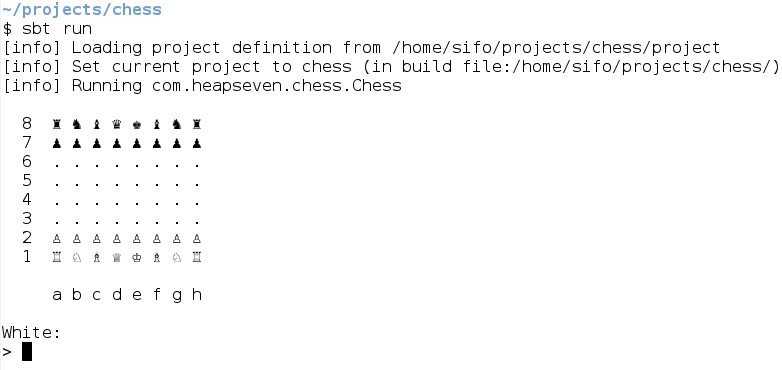

# Chess

## Features

Fully implements chess (with checkmate, stalemate, en passant, promotion, etc.).

## Help

- `d2d4` to move the piece in `d2` to `d4`.
- `d` or `draw` to ask draw to opponent.
- `r` or `restart` to restart the game.
- `queen`, `rook`, `bishop`, `knight`, to promote.
- `e` or `exit` to quit.
- `h` or `help` for help.

## Implementation 

The game is written in scala in a functional way. Tests are written with scalatest and cover every features.
